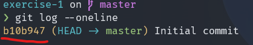
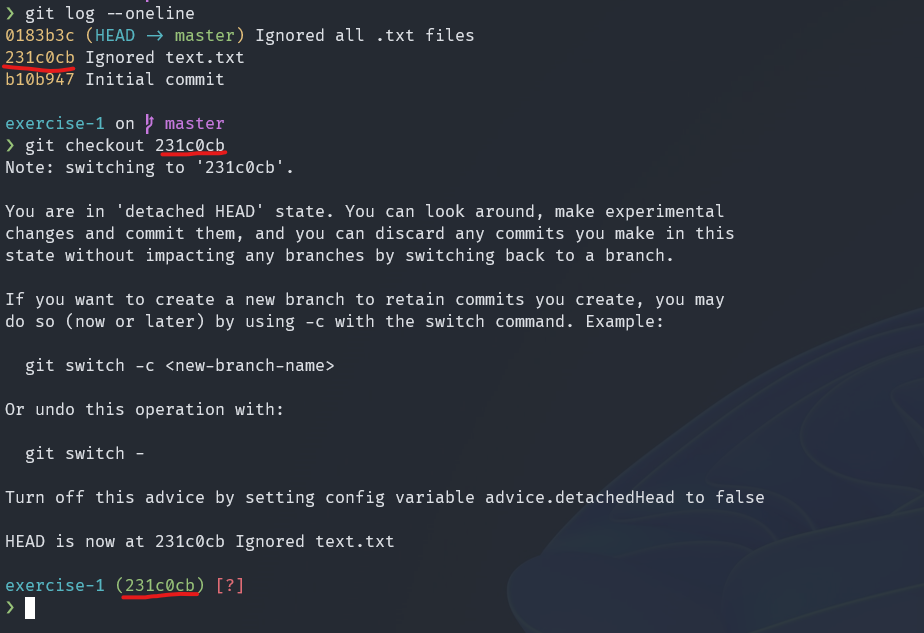

# Exercise 1

## Walkthrough
1. Create a directory called exercise-1 and move into it.
```bash
mkdir exercise-1
cd exercise-1
```
2. Create a repository and run **git status** and **git log**.
```bash
git init
```
```bash
git status
```
```bash
git log
```
3. Create **README.md** and write **# Exercise 1** to it.
```bash
echo "# Exercise 1" > README.md
```
4. Run **git status**. You should have an **untracked** file. 
```bash
git status
```
5. **Try** to remove **README.md** using **git rm**. Remove the file using the bash command **rm**.
```bash
git rm README.md
```
```bash
rm README.md
```
6. Do **step 3** and add **README.md** to the **staging** area of the repo.

See step 3.
```bash
git add README.md
```
7. Run **git status** and **unstage** the change using **git rm**.
```bash
git status
```
```bash
git rm --cached README.md
```
8. Add **README.md** to the **staging** area and **try** to unstage it using **git restore** and **git checkout**.
```bash
git add README.md
```
```bash
git restore README.md
```
```bash
git checkout
```
9. Make a **commit** with the message **"Initial commit"**
```bash
git commit -m "Initial commit"
```
10. Run **git status, git log** and **git log --oneline**. What is the short commit id?
```bash
git status
```
```bash
git log
```
```bash
git log --oneline
```


11. Remove **README.md** from the repo using **git rm**.
```bash
git rm README.md
```
12. Run **git status** and then **unstage** the change using **git restore** or **git reset**
```bash
git status
```
```bash
git reset
```
13. Run **git status** and **discard** the changes usingn **git restore** or **git checkout**.
```bash
git status
```
```bash
git restore README.md
```
14. Create a text.txt file and **ignore** it. Run **git status**
```bash
touch text.txt && echo "text.txt" > .gitignore
```
```bash
git status
```
15. Add the change to the staging area and then **commit** it with the message **"First commit"**
```bash
git add .gitignore && git commit -m "First commit"
```
16. Run **git status** and **git log**. Change the message of the last commit to **"Ignored text.txt"**
```bash
git status
```
```bash
git log
```
```bash
git commit --amend -m "Ignored text.txt"
```
17. Run **git log**. Create document.txt and add it to the staging area.
```bash
git log
```
```bash
touch document.txt && git add document.txt
```
18. Run **git status** and **ignore** all **.txt** files.
```bash
git status
```
```bash
echo "*.txt" > .gitignore
```
19. Unstage **document.txt** and stage **.gitignore** and run **git status** 
```bash
git restore --staged document.txt
```
```bash
git add .gitignore
```
```bash
git status
```
20. Commit the changes with message **"Ignored all .txt files"**
```
git commit -m "Ignored all .txt files"
```
21. Run **git log --oneline** and **checkout** the **first commit*
```
git log --oneline
```
```
git checkout <commit id>
```

22. Run **git log --oneline** and **checkout** the **last** commit using **git checkout master** or **git switch -**.
```
git log --oneline
```
```
git switch -
```
